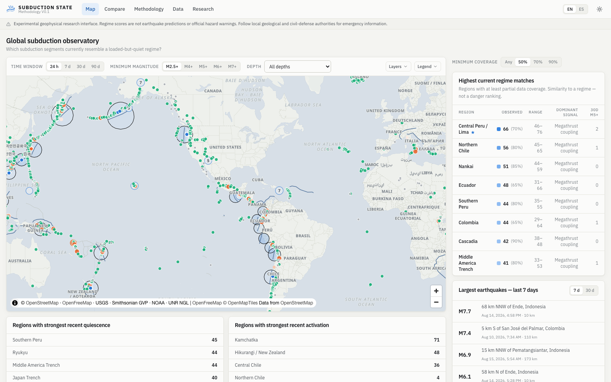
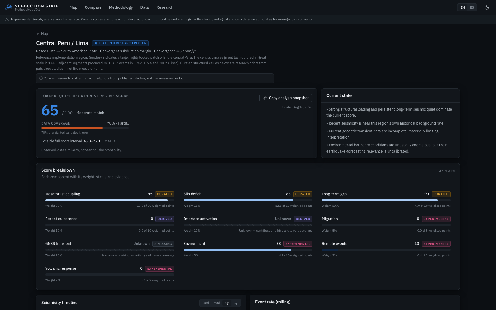

# Subduction State

**A global observatory of loaded-but-quiet subduction regimes.**

Subduction State is an experimental, bilingual (EN/ES) research interface that asks one
narrow question:

> How strongly does the currently observed state of a subduction segment match a
> **high coupling + accumulated deformation + relative seismic quiet + possible external
> perturbation** regime?

It is **not** an earthquake prediction system. The score is a *similarity metric over
observable data* — never a rupture probability, a countdown, or an official warning.

---

## Screenshots

| | |
|---|---|
| Global map + dashboard (light) | Region analysis, Lima (dark) |
|  |  |

## Concept

Ten weighted variables (canonical **V0.1**, total = 100) describe the hypothesised
loaded-but-quiet megathrust regime:

| Variable | Weight | Type |
|---|---:|---|
| Megathrust coupling / asperity geometry | 20 | curated prior |
| Accumulated slip deficit / cycle maturity | 15 | derived |
| Long-term seismic gap / persistent quiescence | 10 | derived |
| Recent local seismic quiescence | 10 | derived |
| Local interface / edge activation | 10 | derived |
| Current GNSS / strain transient | 20 | derived (often unknown) |
| Ocean / climate / hydrological perturbation | 5 | experimental |
| Remote dynamic / same-margin perturbation | 3 | experimental |
| Volcanic multidomain response | 2 | experimental |
| Along-margin migration | 5 | experimental |

**Structural variables for every region.** There is no global live coupling
API, so the three structural variables are built as:

- **Coupling** — a published, cited per-segment literature prior (e.g.
  Villegas-Lanza et al. 2016 for central Peru; McCaffrey et al. for Cascadia;
  Yokota et al. 2016 for Nankai; Chlieh et al. 2008 for Sumatra; …). The value
  shown is `locking fraction × 100` with the cited range and confidence.
- **Slip deficit (derived)** — `convergence (MORVEL) × years since the last
  full-segment great rupture × coupling`, scored against empirical slip
  scaling (4 m → 35, 10 m → 78, ≥18 m → 100) and combined 0.6·deficit +
  0.4·maturity. Partial ruptures (e.g. Lima 1942/1974/2007) do **not** reset
  the full-segment deficit.
- **Long-term gap (derived)** — great-rupture gap vs the segment's own
  recurrence estimate where published (Cascadia ~500 a, Nankai ~117 a,
  Mentawai ~200 a, northern Chile ~120 a), with a documented 300-a fallback.

The rupture record itself is public catalog fact (USGS/NEIC, NOAA), stored
per profile with `fullSegment` flags — so every region is computed from the
same transparent pipeline, not hand-set scores. Margins with no recorded
segment-scale great rupture (e.g. the Philippines) honestly return *unknown*
for the derived metrics.

**Moment tensors (USGS ComCat)** are read for recent M5.5+ events on region
pages: reverse-mechanism classification (rake within ±45° of 90° on a plane
dipping < 60°; interface-consistent at 10–60 km depth) raises the
interface-activation metric's confidence and adds an interface-thrust
fraction to its evidence.

Score mathematics (missing data never become zero):

```
knownContribution = Σ(weightᵢ × scoreᵢ / 100)        over known metrics
knownWeight       = Σ(weightᵢ)                        over known metrics
observed          = knownContribution / knownWeight × 100
full interval     = [knownContribution, knownContribution + missingWeight]
neutralImputed    = knownContribution + missingWeight × 0.5   (research only)
coverage          = knownWeight / 100
```

Every score is presented with its **coverage** and **full-score interval**, and opens an
evidence drawer with the raw value, transformation, formula, source, freshness and
confidence. The primary number is always the *observed-data score*.

## Why this is not an earthquake prediction model

- The score measures **similarity to a hypothesised regime** — a descriptive statistic
  over heterogeneous observations. It is not calibrated against future ruptures and has
  no probabilistic interpretation.
- “Slip-deficit maturity” is a **cycle-maturity feature**, not “percent toward failure”.
- Remote earthquakes raise an explicitly experimental **geometric/time-decay proxy** —
  it is not Coulomb stress transfer and does not establish triggering.
- Environmental variables (SST, sea level, ENSO) carry ≤ 5 % weight precisely because
  their causal earthquake-predictive value is unvalidated. ENSO is global context only.
- **Unknown ≠ normal.** A missing variable (GNSS for most segments today) is excluded
  from the score and lowers coverage; it is never imputed as zero.
- Correlation is not causation: coincident volcanic, climatic or remote-seismic signals
  are displayed as boundary conditions, never as causes.
- Nothing here is a product of, or endorsed by, any civil-defense or geological agency.

See `/methodology` in the app for the full write-up.

## Architecture

```
src/
  app/                    # Next.js 16 App Router (all pages client-driven dashboards)
    api/…                 # server route handlers (the only upstream callers)
  data/
    adapters/             # usgs-earthquakes, usgs-plates, gem-faults, gvp-volcanoes,
                          # noaa-sst, noaa-ssh, noaa-enso, gnss (UNR NGL)
    http.ts               # cached fetch: live → memory → disk (labeled stale) → fixture
    health.ts             # DataHealth registry surfaced on /data
    region-data.ts        # per-region dynamic-data assembly
    scores.ts             # global + per-region score orchestration
  scoring/                # pure, isomorphic, unit-tested:
    weights.ts score.ts quiescence.ts activation.ts migration.ts
    remote-perturbation.ts environment.ts gnss.ts volcanic.ts bvalue.ts
    decluster.ts summary.ts changefeed.ts timeseries.ts config.ts
  regions/profiles.ts     # Zod-validated loader for data/regions/*.json
  components/             # UI shell, map, dashboards, charts, primitives
  i18n/                   # EN/ES dictionaries + provider (localStorage-persisted)
  map-styles/             # custom light/dark MapLibre styles on OpenFreeMap vector tiles
data/regions/             # curated region profiles (geometry + research priors)
fixtures/                 # labeled "Cached demo snapshot" fallbacks (real captured data)
e2e/ tests/               # Playwright smoke tests, Vitest unit tests
```

Key behaviors:

- **External APIs are never called from UI components** — only from server adapters
  through `cachedFetch`, with per-source TTLs (feeds 5 min, regional catalogs 6 h,
  geometry 7 d, GNSS series 12 h…).
- **Zod validates every upstream payload**; parse failures degrade to cached/fixture
  data with visible labels.
- **Fixtures are real captured snapshots** (not synthetic), shown only when upstreams
  fail, and always labeled *Cached demo snapshot*.
- **GNSS has no fixture by design**: if processed time series (UNR NGL, IGS20 tenv3)
  cannot be fetched, the metric is `Unavailable` and stays `null`.
- **Scoring is pure TypeScript** — the same functions run on the server (canonical V0.1)
  and in the browser (research-mode re-weighting), and a Supabase/Postgres layer could
  later cache snapshots without touching the engine.

## Setup

```bash
npm install
npm run dev          # http://localhost:3000
```

Production:

```bash
npm run build
npm start
```

Checks:

```bash
npm run lint         # ESLint (0 errors)
npx tsc --noEmit     # TypeScript strict
npm test             # Vitest unit tests (score math, i18n parity, profiles)
npm run e2e          # Playwright smoke tests (starts or reuses a server on :3210)
SMOKE=1 npx vitest run tests/smoke.live.test.ts   # live-upstream pipeline tests
```

The first request after a cold start computes regional scores from live catalogs
(bounded to ~25 s; the client polls until `complete`). A background warmup
(`src/instrumentation.ts`) primes caches at server start; set `DISABLE_WARMUP=1` to skip.

### Environment variables

| Variable | Purpose |
|---|---|
| `GEM_GAF_URL` | Optional URL to a GEM GAF-DB GeoJSON export for the active-faults map layer (context only — never a hazard model). Without it the layer reports *not configured*. |
| `DISABLE_WARMUP` | Set to `1` to skip background cache warmup. |

No keys are required: all sources are public. No database, no authentication.

## Data sources

| Source | Use | License/attribution |
|---|---|---|
| USGS ComCat (FDSN + feeds) | earthquakes, regional catalogs, plate boundaries (ArcGIS) | public domain |
| Smithsonian Global Volcanism Program (VOTW WFS) | Holocene volcanoes, last-known eruptions | Smithsonian GVP |
| NOAA CoastWatch ERDDAP — CRW SST anomaly, blended SLA | environmental point samples | NOAA |
| NOAA CPC | ONI / ENSO context | NOAA |
| Nevada Geodetic Laboratory, UNR | processed GNSS position time series (IGS20 tenv3) | UNR NGL |
| GEM Global Active Faults Database | optional fault-geometry layer | CC-BY-SA |
| OpenFreeMap + OpenStreetMap | basemap vector tiles | ODbL |

Attribution is kept visible in the map control and the footer.

## Score methodology (summary)

- **Quiescence** — Gamma–Poisson posterior rate vs the region's own 5-year baseline,
  transformed by documented anchors (20 %→25, 40 %→50, 55 %→75, ≥70 %→100).
- **Activation** — independent events in the coupling edge-buffer (or boundary corridor),
  scored as a Poisson percentile (50th→5, 75th→35, 90th→60, 95th→75, 99th→100).
- **GNSS** — per-station robust-Z of detrended residuals (1.4826×MAD), aggregated as the
  median; requires ≥ 3 usable stations or stays unknown.
- **Migration** — declustered M4.5+ projected along-strike, ≥ 4 independent clusters and
  ≥ 120 km spread required, Spearman ρ of position vs time.
- **Remote perturbation** — strongest single M6.5+ event within 2500 km/30 d with
  distance/time decay (×1.5 same-margin); a proxy, never stress transfer.
- **Declustering** — ETAS-lite: magnitude-dependent radius (10^(0.5M−1.4) km) and window
  (10^(0.55M−1.95) d) around prior M6+ events.

Formulas, anchors and limitations are enumerated on `/methodology`.

## Current known gaps

- Coupling priors are segment-average literature values — per-patch coupling
  geometry is not served by any global public API (the evidence drawer always
  shows the citation, range and confidence).
- GNSS coverage depends on public processed series; most segments have < 3 current
  stations nearby, so the metric legitimately stays *unknown*.
- GEM fault geometry requires a configured export URL.
- Historical replay (`?asOf=`) recomputes **seismic-derived metrics only** — GNSS,
  environmental and volcano history are shown as unknown rather than fabricated.
- Volcano “new activity” uses GVP eruption-onset years (approximate, back-filled).
- 30 d/90 d map windows are M4+/M4.5+ (sub-M4 detail only on 24 h/7 d feeds).

## How to add a new subduction region

1. Create `data/regions/<slug>.json`:

```json
{
  "id": "<slug>",
  "slug": "<slug>",
  "name": { "en": "…", "es": "…" },
  "platePair": { "en": "Lower → Upper Plate", "es": "… → …" },
  "margin": "<margin-group-id>",
  "center": [lon, lat],
  "radiusKm": 350,
  "trench": [[lon, lat], …],
  "strikeAzimuthDeg": 315,
  "convergence": { "rateMmYr": 67, "azimuthDeg": 78, "source": "…" },
  "couplingPrior": {
    "value": 0.85, "range": [0.7, 1.0],
    "sourceName": "Author(s) (year) — title/journal",
    "sourceDate": "2013-01-01", "confidence": 0.7
  },
  "greatRuptures": [
    { "year": 1877, "mag": 8.8, "fullSegment": true, "label": "…" },
    { "year": 2014, "mag": 8.2, "label": "partial" }
  ],
  "recurrence": { "years": 120, "source": "published estimate (…)" },
  "envSamplePoint": [lon, lat],
  "context": { "en": "…", "es": "…" }
}
```

   The analysis polygon is generated from `center`/`radiusKm`. Use the same `margin`
   id as neighboring segments so same-margin remote-perturbation logic works.
2. **Cite everything.** `couplingPrior` must reference a real published geodesy
   study (value + range + confidence); `greatRuptures` come from the public
   historical catalog (USGS/NEIC, NOAA) with `fullSegment` true only for
   ruptures that released essentially the whole segment. Slip deficit and
   long-term gap are then COMPUTED for the new region by the same pipeline —
   never hand-set.
3. Restart the server — the profile is validated (Zod) and picked up automatically;
   dynamic metrics compute from live data on the next scoring pass.

## Deployment

Any Node host works (Vercel, Fly, Railway, Docker):

```bash
npm ci && npm run build && npm start   # PORT configurable, e.g. PORT=8080
```

The app needs outbound HTTPS to the public APIs above; the on-disk cache
(`.cache/upstream`) is optional and can be mounted as a volume for warm restarts.

---

*Experimental geophysical research interface. Regime scores are not earthquake
predictions or official hazard warnings. Follow local geological and civil-defense
authorities for emergency information.*
